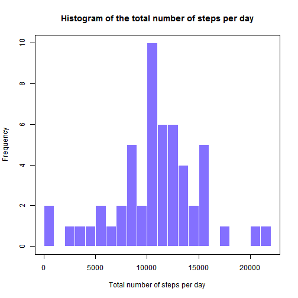
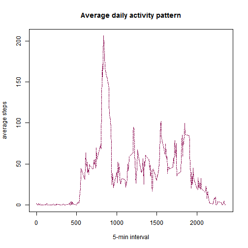
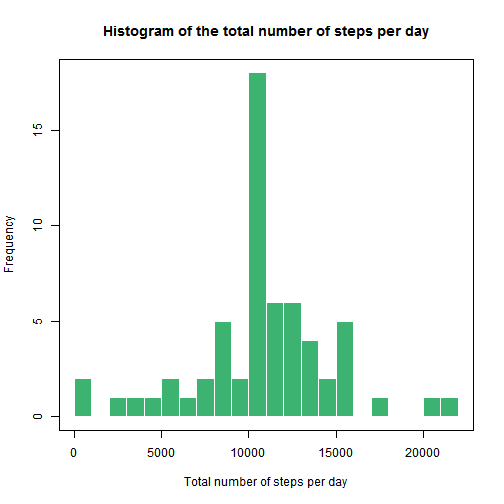
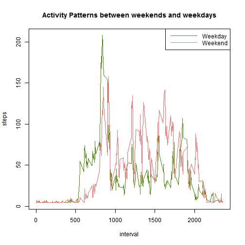

This assignment makes use of data from a personal activity monitoring device. This device collects data at 5 minute intervals through out the day. The data consists of two months of data from an anonymous individual collected during the months of October and November, 2012 and include the number of steps taken in 5 minute intervals each day.

### Data

The data for this assignment can be downloaded from the course web site:
https://d396qusza40orc.cloudfront.net/repdata%2Fdata%2Factivity.zip

#### The variables included in this dataset are:

    * steps: Number of steps taking in a 5-minute interval (missing values are coded as NA)

    * date: The date on which the measurement was taken in YYYY-MM-DD format

    * interval: Identifier for the 5-minute interval in which measurement was taken

The dataset is stored in a comma-separated-value (CSV) file and there are a total of 17,568 observations in this dataset. The data should be downloaded and saved in the working directory.

### The Code
####Load the data


```r
data_row<-read.csv("repdata_data_activity/activity.csv")
str(data_row)
```

```
## 'data.frame':	17568 obs. of  3 variables:
##  $ steps   : int  NA NA NA NA NA NA NA NA NA NA ...
##  $ date    : Factor w/ 61 levels "2012-10-01","2012-10-02",..: 1 1 1 1 1 1 1 1 1 1 ...
##  $ interval: int  0 5 10 15 20 25 30 35 40 45 ...
```
####Load dplyr library

```r
library(dplyr)
```
####Process the data - remove NA

```r
data<-filter(data_row,!is.na(steps))
str(data)
```

```
## 'data.frame':	15264 obs. of  3 variables:
##  $ steps   : int  0 0 0 0 0 0 0 0 0 0 ...
##  $ date    : Factor w/ 61 levels "2012-10-01","2012-10-02",..: 2 2 2 2 2 2 2 2 2 2 ...
##  $ interval: int  0 5 10 15 20 25 30 35 40 45 ...
```
###1. What is mean total number of steps taken per day?
####Calculate the total number of steps taken per day

```r
sum_steps_day<-
        data %>%
        group_by(date) %>%
        summarize (sum(steps))
colnames(sum_steps_day)<-c('date','sum_steps')
```
####Make a histogram of the total number of steps taken each day

```r
hist(sum_steps_day$sum_steps, breaks=20,col="lightslateblue", border='white',
     xlab='Total number of steps per day',
     main="Histogram of the total number of steps per day")
box()
```

 

####Calculate and report the mean and median of the total number of steps taken per day 

```r
print(mean(sum_steps_day$sum_steps))
```

```
## [1] 10766.19
```

```r
print(median(sum_steps_day$sum_steps))
```

```
## [1] 10765
```
*The mean and median total number of steps per day are almost the same.*

###2. What is the average daily activity pattern?
####Make a time series plot of interval and the average number of steps taken, averaged across all days

```r
avg_steps_per_interval<-
        data %>%
        group_by(interval) %>%
        summarize (mean(steps))

colnames(avg_steps_per_interval)<-c('interval','mean_steps')

plot(mean_steps ~ interval, data = avg_steps_per_interval, type = "l", col="deeppink4", lty=6 ,xlab="5-min interval", ylab="average steps", main="Average daily activity pattern")
box()
```

 

###Which 5-minute interval, on average across all the days in the dataset, contains the maximum number of steps?

```r
a<-avg_steps_per_interval$interval[avg_steps_per_interval$mean_steps==max(avg_steps_per_interval$mean_steps)]
print(a)
```

```
## [1] 835
```
*The interval number 835.*

###3. Imputing missing values
####Calculate and report the total number of missing values in the dataset

```r
missing<-nrow(data_row)-nrow(data)
print(missing)
```

```
## [1] 2304
```
####Filling in all of the missing values in the dataset, create a new dataset

```r
mean<-round(mean(data$steps))
data_new<-data_row
data_new$steps[is.na(data_new$steps)]<-mean
```
####Make a histogram of the total number of steps taken each day

```r
sum_steps_day_new<-
        data_new %>%
        group_by(date) %>%
        summarize (sum(steps))

colnames(sum_steps_day_new)<-c('date','sum_steps')

hist(sum_steps_day_new$sum_steps, breaks=20,col="mediumseagreen", border='white',
     xlab='Total number of steps per day',
     main="Histogram of the total number of steps per day")
box()
```

 

####Calculate and report the mean and median total number of steps taken per day

```r
print(mean(sum_steps_day_new$sum_steps))
```

```
## [1] 10751.74
```

```r
print(median(sum_steps_day_new$sum_steps))
```

```
## [1] 10656
```

*Mean and median differ from the estimates from the first part of the assignment,
However the impact of imputing missing is low.*

###4. Are there differences in activity patterns between weekdays and weekends?

```r
data_new$date<-as.Date(data_new$date)
library(lubridate)
data_new_w<-mutate(data_new,week=wday(data_new$date))
data_new_w$week[data_new_w$week==2 | data_new_w$week==3 | data_new_w$week==4 | data_new_w$week==5 | data_new_w$week==6]<-"weekday"
data_new_w$week[data_new_w$week==7 | data_new_w$week==1 ]<-"weekend"
```

#### Make a panel plot containing a time series plot of the 5-minute interval and the average number of steps taken, averaged across all weekday days or weekend days


```r
avg_steps_per_week <- aggregate(data_new_w$steps, by = list(data_new_w$interval, data_new_w$week), mean)
colnames(avg_steps_per_week)<-c("interval","week","steps") 
data_new_w$week<-as.factor(data_new_w$week) 

par(mfrow=c(1,1))  
with(avg_steps_per_week, plot(steps ~ interval, type="n", main="Activity Patterns between weekends and weekdays"))  
with(avg_steps_per_week[avg_steps_per_week$week=="weekday",],type="l", lines(steps ~ interval, col="chartreuse4"))  
with(avg_steps_per_week[avg_steps_per_week$week=="weekend",],type="l", lines(steps ~ interval, col="indianred1" ))  
legend("topright", lty=c(1,1), col = c("chartreuse4", "indianred1"), legend = c("Weekday", "Weekend"), seg.len=5)
```

 

